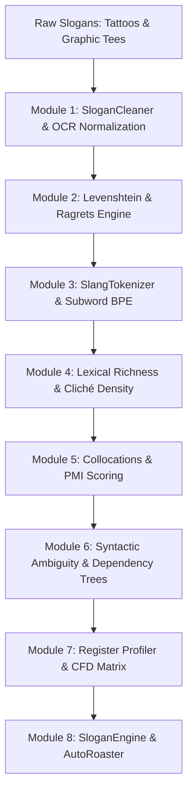

# 👕 Project Ink & Cotton
### *Deconstructing Bad Tattoos & Novelty Graphic Tees with NLP*

[](https://github.com/evecount/BadTattoos_NLP_workbook/actions)
[](https://www.python.org/downloads/)
[](https://opensource.org/licenses/MIT)
[](https://github.com/psf/black)
[](https://colab.research.google.com/)

A modular, applied Python workbook lab designed to teach core text processing, spelling correction, syntactic parsing, and stylometrics through the lens of typographical errors, ironic graphic tees, and mistranslated ink.

Students master foundational Natural Language Processing algorithms by deconstructing infamous tattoo blunders (*"No Ragrets"*, *"Never Don't Give Up"*, *"Strenght"*), analyzing ambiguous novelty tees (*"Let's eat kids"* vs. *"Let's eat, kids"*), and building an automated Slogan Generator & Auto-Roaster.

---

## 🏛️ Pedagogical Architecture & Pipeline

```text
Raw Slogan & Caption Scrapes (.csv / .json)
   │
   ▼
[Module 1: Normalization & Regex Cleaning] ────► OCR Noise, Line Breaks, Case Variations
   │
   ▼
[Module 2: The "Ragrets" Engine] ──────────────► Levenshtein Distance, Edit Paths & Spellcheckers
   │
   ▼
[Module 3: Tokenization & Subword Glitches] ──► Character vs. Word Splitting, BPE on Slang
   │
   ▼
[Module 4: Lexical Richness & Saturation] ────► TTR, Hapaxes, and Cliché Saturation
   │
   ▼
[Module 5: Collocation Traps & Fixed Tropes] ──► Bigrams, Pointwise Mutual Information (PMI)
   │
   ▼
[Module 6: Syntactic Ambiguity & spaCy] ──────► Punctuation Shifts, Modifier Attachment
   │
   ▼
[Module 7: Stylometric Register Profiling] ───► CFD: Alpha Biker Ink vs. Ironic Graphic Tees
   │
   ▼
[Module 8: Slogan Generator & Auto-Roaster] ──► Markov Chains vs. Few-Shot Roast Auditing
```



---

## 📚 Curriculum & 8-Module Syllabus

| Module | Title | Core NLP Concepts | Slogan Domain Application | Colab Link |
|---|---|---|---|---|
| **01** | **Ingestion & OCR Normalization** | Regular expressions, string encoding, whitespace stripping | Normalize OCR scanning artifacts, linebreaks, and erratic casing (`nO rEgReTs` $\rightarrow$ `No Regrets`) | [](https://colab.research.google.com/github/evecount/BadTattoos_NLP_workbook/blob/main/notebooks/01_ocr_slogan_cleaner.ipynb) |
| **02** | **The "Ragrets" Engine** | Levenshtein Minimum Edit Distance, DP matrix, unigram language modeling | Diagnose infamous tattoo blunders (*No Ragrets*, *Strenght*, *Sweet Pee*) and trace backtracked edit paths | [](https://colab.research.google.com/github/evecount/BadTattoos_NLP_workbook/blob/main/notebooks/02_levenshtein_ragrets.ipynb) |
| **03** | **Subword Slang Tokenization** | Word vs. Subword BPE tokenization, Out-of-Vocabulary (OOV) | Segment modern internet slang (*delulu*, *yeet*, *smol*) to prevent `<UNK>` token collapse | [](https://colab.research.google.com/github/evecount/BadTattoos_NLP_workbook/blob/main/notebooks/03_subword_slang_tokens.ipynb) |
| **04** | **Lexical Diversity & Cliché Detection** | Types vs. Tokens ($V, N$), TTR, Root TTR, Hapax Legomena | Quantify vocabulary redundancy and cliché saturation in motivational alpha ink (*strength, warrior, lion, king*) | [](https://colab.research.google.com/github/evecount/BadTattoos_NLP_workbook/blob/main/notebooks/04_cliche_lexical_ttr.ipynb) |
| **05** | **Collocation Traps & Fixed Tropes** | Bigrams, Trigrams, Pointwise Mutual Information (PMI) | Contrast high-frequency functional bigrams (*in the*) with high-PMI bound phrases (*carpe diem*, *live laugh*) | [](https://colab.research.google.com/github/evecount/BadTattoos_NLP_workbook/blob/main/notebooks/05_collocation_finders.ipynb) |
| **06** | **Syntactic Ambiguity & Dependency Trees** | Part-of-Speech (POS) tagging, dependency parse trees, modifier ambiguity | Analyze how missing commas shift meaning: *"Let's eat kids"* vs. *"Let's eat, kids"* (Direct Object vs. Vocative address) | [](https://colab.research.google.com/github/evecount/BadTattoos_NLP_workbook/blob/main/notebooks/06_spacy_ambiguity_trees.ipynb) |
| **07** | **Stylometric Register Profiling** | Conditional Frequency Distributions (CFD), contingency tables | Profile the vocabulary of **Motivational Biker Ink** vs. **Ironic Graphic Tees** per 1,000 words | [](https://colab.research.google.com/github/evecount/BadTattoos_NLP_workbook/blob/main/notebooks/07_stylometric_cfd.ipynb) |
| **08** | **Slogan Generator & Auto-Roaster** | Markov Chains, prompt-conditioned sampling, quality auditing | Synthesize new tattoo slogans and audit user submissions for typos, cannibalism hazards, and cliché overload | [](https://colab.research.google.com/github/evecount/BadTattoos_NLP_workbook/blob/main/notebooks/08_slogan_engine.ipynb) |

---

## ⚡ Quickstart

### 1. Clone the Repository
```bash
git clone https://github.com/evecount/BadTattoos_NLP_workbook.git
cd BadTattoos_NLP_workbook
```

### 2. Environment Setup

#### Option A: Using Conda (Recommended)
```bash
conda env create -f environment.yml
conda activate inkcotton
```

#### Option B: Using Python Virtual Environment
```bash
python -m venv venv
# Windows:
.\venv\Scripts\activate
# Linux/macOS:
source venv/bin/activate

pip install -r requirements.txt
pip install -e .
```

### 3. Launch Notebooks
```bash
jupyter notebook notebooks/
```

---

## 🧪 Autograding & Local Verification

Students can verify their code locally at any point across all 8 modules:

```bash
# Run the 8-module automated verification suite
python tests/autograde_checks.py

# Run unit tests
python -m unittest discover tests
```

Sample output:
```text
===========================================================================
 PROJECT INK & COTTON: COMPREHENSIVE 8-MODULE AUTOGRADING SUITE
===========================================================================
[Testing Module 1: Ingestion, OCR Glitches & Regex Normalization]...       PASS
[Testing Module 2: Levenshtein Distance & Spelling Correction]...           PASS
[Testing Module 3: Tokenization & Subword Splitting on Slang]...            PASS
[Testing Module 4: Lexical Diversity & Cliché Detection]...                 PASS
[Testing Module 5: Collocation Traps & Fixed Semantic Tropes]...            PASS
[Testing Module 6: Syntactic Ambiguity & spaCy Parsing]...                  PASS
[Testing Module 7: Stylometric Register Profiling via CFD]...               PASS
[Testing Module 8: Slogan Generator & Auto-Roaster]...                      PASS
===========================================================================
 [SUCCESS] ALL 8 MODULE VERIFICATION SUITES PASSED PERFECTLY! 
===========================================================================
```

---

## 📦 Python Toolkit: `inkcotton`

The repository includes a production-ready Python package `inkcotton`:

```python
from inkcotton import (
    SloganCleaner,
    LevenshteinDistance,
    RagretsEngine,
    AmbiguityParser,
    AutoRoaster,
)

# 1. Clean OCR noise and normalize casing
cleaner = SloganCleaner()
clean_text = cleaner.clean_slogan("  nO  rEgReTs ---> !!!")
print(clean_text)  # "No Regrets!"

# 2. Diagnose tattoo typos using edit distance
engine = RagretsEngine("data/dictionary_reference.txt")
corrections = engine.suggest_corrections("ragrets")
print("Top Suggestion:", corrections[0]["candidate"])  # "regrets"

# 3. Detect syntactic cannibalism hazards
parser = AmbiguityParser()
report = parser.analyze_vocative_comma("Let's eat kids")
print(report["hazard_warning"])  # "🚨 Cannibalism detected: Direct object relation without vocative comma!"

# 4. Roast proposed slogans
roaster = AutoRoaster()
roast = roaster.audit_slogan("No Ragrets, Let's eat kids!")
print(roast["roast_verdict"])
```

---

## 📂 Repository Structure

```text
BadTattoos_NLP_workbook/
├── .github/
│   └── workflows/ci.yml               # Automated CI test suite
├── data/
│   ├── tattoos_raw.csv                # Scraped tattoo quotes & blunder captions
│   ├── graphic_tees_raw.csv           # Slogan t-shirt titles & syntactic hazards
│   ├── combined_slogans_corpus.json   # Unified JSON dataset
│   └── dictionary_reference.txt       # Unigram frequency vocabulary
├── notebooks/                         # 8 interactive Jupyter workbooks
│   ├── 01_ocr_slogan_cleaner.ipynb
│   ├── 02_levenshtein_ragrets.ipynb
│   ├── 03_subword_slang_tokens.ipynb
│   ├── 04_cliche_lexical_ttr.ipynb
│   ├── 05_collocation_finders.ipynb
│   ├── 06_spacy_ambiguity_trees.ipynb
│   ├── 07_stylometric_cfd.ipynb
│   └── 08_slogan_engine.ipynb
├── inkcotton/                         # Modular core Python library
│   ├── __init__.py
│   ├── cleaner.py                     # SloganCleaner (Regex & OCR noise)
│   ├── spellchecker.py                # LevenshteinDistance & RagretsEngine
│   ├── tokenizer.py                   # SlangTokenizer (Subwords & OOV)
│   ├── metrics.py                     # LexicalRichness & ClicheDetector
│   ├── collocations.py                # CollocationTraps (PMI & Tropes)
│   ├── syntax.py                      # AmbiguityParser (spaCy trees & commas)
│   ├── stylometrics.py                # RegisterProfiler (CFD matrices)
│   └── roaster.py                     # SloganEngine & AutoRoaster
├── tests/
│   ├── autograde_checks.py            # Local student verification suite
│   └── test_inkcotton.py              # Unit tests
├── environment.yml                    # Conda reproducibility manifest
├── requirements.txt                   # Pip dependency requirements
├── pyproject.toml                     # Python package metadata
├── CONTRIBUTING.md                    # Contribution guidelines
├── LICENSE                            # MIT License
└── README.md                          # Master curriculum documentation
```

---

## ⚖️ License & Acknowledgments

Distributed under the **MIT License**. Slogans, tattoo captions, and pop culture phrases are analyzed under fair use for educational linguistic demonstration.

Created with ❤️ for students mastering Applied Natural Language Processing.
